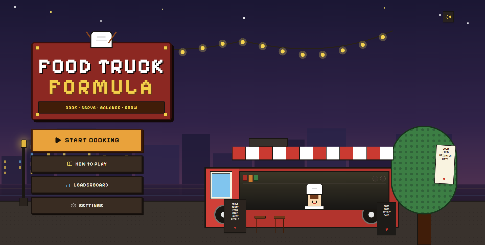
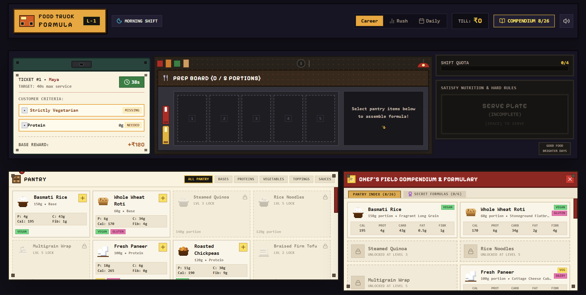

# Food Truck Formula

A fast-paced dark-themed culinary puzzle game where players assemble authentic street food plates to satisfy dietary rules, nutritional targets, and hungry customers before time runs out.

## Description

I created Food Truck Formula because I wanted a fun, tactical cooking puzzle that challenges players with real-world culinary nutrition without feeling like a boring math problem. I built the game as a standalone React web application using TypeScript, Vite, Tailwind CSS, and Lucide React icons. The game engine features dynamic order generation with guaranteed solvability, live macronutrient calculation, dietary allergen validation, recipe discovery, keyboard navigation, and procedural sound effects generated entirely with the browser's Web Audio API.

### Screenshots

 

## Getting Started

### Dependencies

- Windows 10/11, macOS, or Linux operating system
- Node.js v18.0.0 or higher
- npm (Node Package Manager)

### Installing

- Clone or download the repository code from GitHub:
  ```bash
  git clone https://github.com/questcreators69-rgb/ftf.git
  ```
- Navigate into the project directory:
  ```bash
  cd ftf
  ```
- Install project dependencies:
  ```bash
  npm install
  ```

### Executing program

- Step 1: Open your terminal inside the project root folder and start the local server by running:
  ```bash
  npm run dev
  ```
- Step 2: Open your browser and navigate to `http://localhost:3000`.
- Step 3: Click "START COOKING" and play using mouse clicks, touch taps, or the `[Space]` key to serve.

## Help

If port 3000 is already in use by another application on your system, run Vite with a custom port:

```bash
npm run dev -- --port 3001
```

To see additional build and project management commands, run:

```bash
npm run --help
```

## License

This project is licensed under the MIT License - see the [LICENSE.md](./LICENSE.md) file for details
